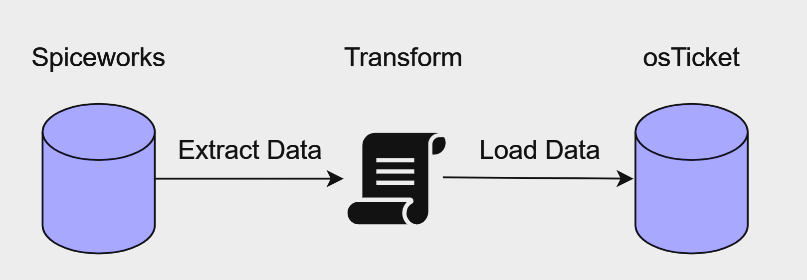
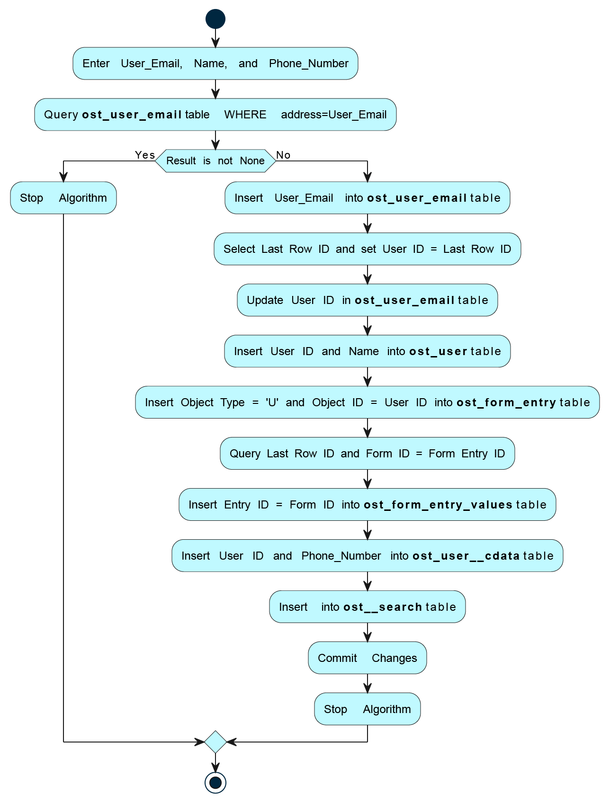
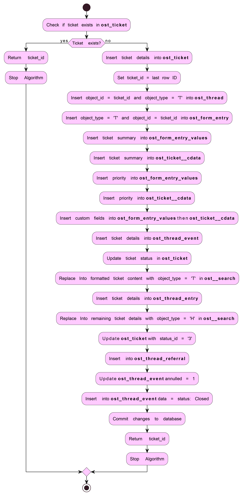
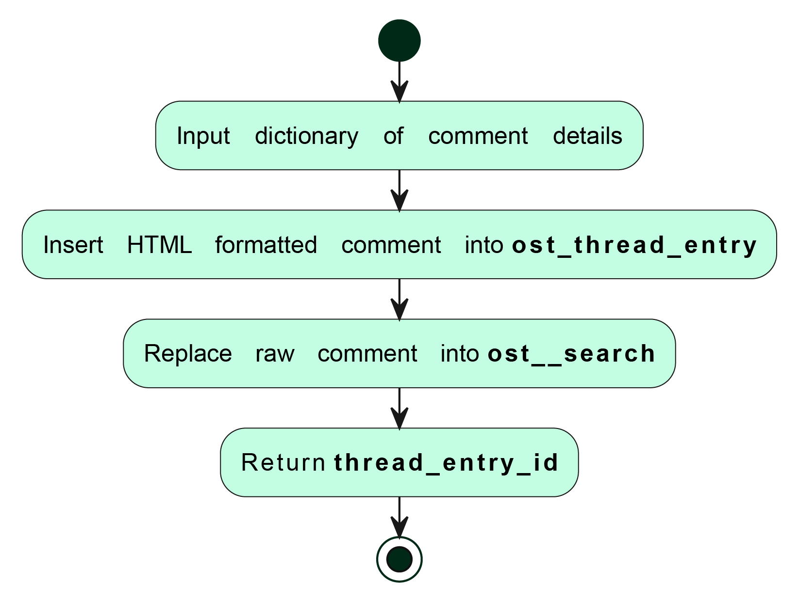
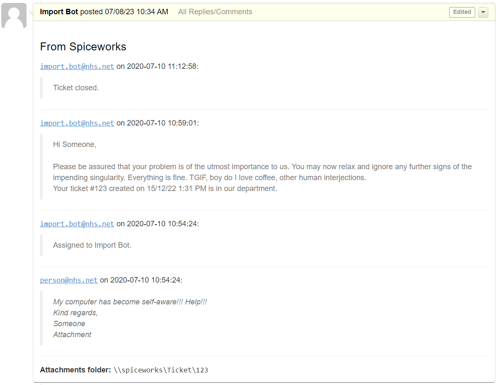

# 00-SpiceWorks-Migration
Spiceworks 7.5.00107 to OsTicket v1.18 database migration 🦆

This migration process involves transferring ticket data, including ticket details, comments, and user information, from the Spiceworks database to the osTicket database - notably, we ignored attachments. To achieve this, import functions have been created in python based on the analysis of osTicket's SQL logs. There are probably many other ways to automate migration, this is just one method. Using this method will require customizing the code written here, but hopefully this helps cut down some of the headache of spending hours scrolling through query logs...

## Getting Started 

### Prerequisites 

The migration functions use the following non-standard package: 
- [mysql-connector-python](https://pypi.org/project/mysql-connector-python/): Python MySQL connector to interact with MySQL databases.

### Installing 

You can install the required packages using pip:

`pip install mysql-connector-python`

## Usage

The **`process_tickets`** function in `main.py` shows an example of how to use the functions created below. Also, workflow explained step by step in `MIGRATION_NOTEBOOK.PY`. The `PLAN.md` describes each function with greater detail. 

### Customization

This migration method requires a descent amount of customization of the following scripts (your custom fields will obviously be different), so familiarity with both export & import databases is definitely required: 
- Update the MySQL database credentials in the 'example_creds.txt' file and then rename the file to 'db_creds.txt'. Please note that this step assumes that the computer you are using to connect to the database has been granted the necessary privileges for remote connection (e.g. `GRANT ALL PRIVILEGES ON *.* TO 'migrator_username'@'%' IDENTIFIED BY 'password';`)
- Create SWlocation.txt file with file path to spiceworks database location 
- Modify the **`hostname`** and **`database_name`** parameters in function calls to match your osTicket database configuration 
- Create an Import Agent for creating tickets and posting replies 
- In **`create_ticket`** function:
   - change help topic value to preferred imported help topic found in **`ost_help_topic`** (**CHANGE 18 -> YOUR IMPORTED HELP TOPIC ID**)
   - adjust the **`ticket_details`** dictionary passed to **`create_ticket`** function to include the appropriate custom fields and their corresponding values
   - **REMOVE LAST 4 FIELDS IN** **`ticket_details`** **DICT AND INSERT STATEMENTS IN** **`create_ticket`** **WITH CHANGE/REMOVE OR FUNCTION WILL NOT WORK**
- Save columns **`id`** and **`value`** from **`ost_list_items`** table dictionaries {value: id}, save mapped dictionaries for {**`value_from_old_ticket_software`**: **`value_in_os_ticket_software`**}

# **Spiceworks: Export**

Within files `get_user.py`, `get_ticket.py`, `get_comment.py`, `get_spiceworks.py`, & `make_html.py`
## Functions 
- Get info about ticket sender `get_user`
- Get ticket content `get_ticket`
- Get all ticket comments into one big HTML string `get_comments`
- Connection helper and wrapper `get_spiceworks`
- HTML comment thread helper `make_html_comment`

# **OsTicket: General Functions**

Within file `create_ticket_helpers_fns.py`

## Functions
- Get credentials to database `get_creds`
- Get connection object to database `connect_to_mysql`
- Find value in dictionary `check_key_in_json_file`
- Get rid of emojis 😿 `get_rid_of_all_fun`

# **OsTicket: Create a User**

Within file `user_exists.py` & `create_user.py`

## Functions 
- Check if user exists  `check_user_account_exists`
- Create user, if user doesn't exist `create_user_if_not_exists`

# **OsTicket: Create a Ticket**

Within file `create_ticket_helper_fns` & `create_ticket.py`

## Functions 
- Check if a ticket exists `ticket_exists`
- Create a ticket `create_ticket`

# **OsTicket: Posting an Internal Note**

## Functions
- Create a Comment `create_comment`

### Example Comment Format

